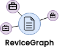
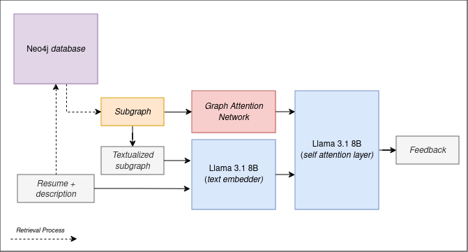

 

<h2 align="center">Resume Reviewer</h2>
  

    An application for resume review, enhanced by Large Language Model (LLM) and knowledge graph.
     
     
    <a href="https://huggingface.co/spaces/alfiannajih/resume-reviewer">Go To Demo</a>
    ·
    <a href="https://huggingface.co/alfiannajih/g-retriever-resume-reviewer">Model Card</a>
    ·
    <a href="#">Video Demo</a>
  

## About The Project
This project is a submission for Compfest: Artificial Intelligence Challenge (AIC) 16.

This project is designed to be used as a resume reviewer. The approach involves retrieving a subgraph from a knowledge graph built from LinkedIn job postings and feeding it into a GNN. The features extracted from the subgraph are further processed and concatenated with the input embeddings from the query text. These concatenated features are then passed through the self-attention layer of Llama 3.1 8B to generate a resume review.

High level view of how the model generated a response can be seen in image below:

## Tools Used
1. [Neo4j Database](https://neo4j.com/)
2. [PyTorch](https://github.com/pytorch/pytorch)
3. [Pytorch Geometric](https://github.com/pyg-team/pytorch_geometric)
4. [Transformers](https://github.com/huggingface/transformers)

## Dataset
1. The knowledge graph was constructed from tabular data sourced from [Kaggle](https://www.kaggle.com/datasets/arshkon/linkedin-job-postings), which was originally scraped from job postings on LinkedIn.
2. The resume and feedback dataset was synthetically generated using GPT-4o.

## Reference
1. Bienstock, Daniel, et al. ”A note on the prize collecting traveling salesman problem.” Mathematical programming 59.1 (1993): 413-420. [[Paper](https://math.mit.edu/~goemans/PAPERS/BienstockGSW-1993-PrizeCollecting.pdf)]
2. He, Xiaoxin, et al. ”G-retriever: Retrieval-augmented generation for textual graph understanding and question answering.” arXiv preprint arXiv:2402.07630 (2024). [[Paper](https://arxiv.org/abs/2402.07630)][[Code](https://github.com/XiaoxinHe/G-Retriever/)]
3. Li, Zehan, et al. ”Towards general text embeddings with multi-stage contrastive learning.” arXiv preprint arXiv:2308.03281 (2023). [[Paper](https://arxiv.org/abs/2308.03281)][[Code](https://huggingface.co/thenlper/gte-base)]
4. Veliˇckovi´c, Petar, et al. ”Graph attention networks.” arXiv preprint arXiv:1710.10903 (2017). [[Paper](https://arxiv.org/abs/1710.10903)]
5. Wang, Yizhong, et al. ”Self-instruct: Aligning language models with self-generated instructions.” arXiv preprint arXiv:2212.10560 (2022) [[Paper](https://arxiv.org/abs/2212.10560)]
