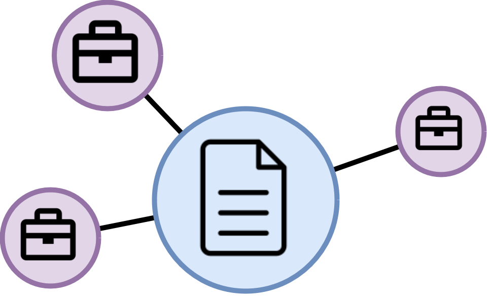

 

<h2 align="center">Resume Reviewer</h2>
  

    An application for resume review, enhanced by Large Language Model (LLM) and knowledge graph.
     
     
    <a href="https://huggingface.co/spaces/alfiannajih/resume-reviewer">Go To Demo</a>
    ·
    <a href="https://huggingface.co/alfiannajih/g-retriever-resume-reviewer">Model Card</a>
    ·
    <a href="#">Video Demo</a>
  

## About The Project
This project is a submission for Compfest: Artificial Intelligence Competition (AIC) 16.

This project is designed to be used as a resume reviewer. The approach involves retrieving a subgraph from a knowledge graph built from LinkedIn job postings and feeding it into a GNN. The features extracted from the subgraph are further processed and concatenated with the input embeddings from the query text. These concatenated features are then passed through the self-attention layer of Llama 3.1 8B to generate a resume review.

High level view of how the model generated a response can be seen in image below:
